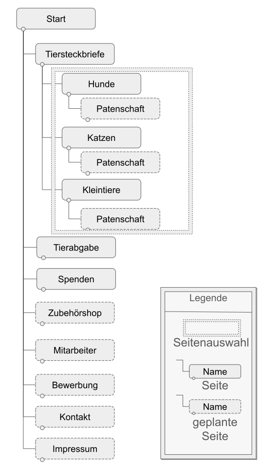

# Zwischenergebnis

## 1. Kurzbeschreibung der Organisation
Beschreiben Sie kurz, für welche Organisation Sie eine Website entwerfen wollen. Stellen Sie diese in groben Zügen vor.

### Antwort
- Aufnahme von verletzten, herrenlosen tieren
- Zuhause für Tiere, ein neues Leben geben
- Vermittlung von Tieren und Spenden
- Pfleger Freiwillige Community (Verein? Gibt es nur Freiwillige oder auch Angestellte?)
- Wissensvermittlung
(Stichpunkte löschen)

Das Tierheim "Pfotenfreunde Trier" setzt sich für hilfsbedürftige Tiere ein. Ein engagiertes Team von Pflegern und Freiwilligen päppelt verletzte Funde wieder auf oder nimmt herrenlose Haustiere entgegen. Als Community setzt sich "Pfotenfreunde Trier" für den Schutz von Tieren ein und konnte in der Vergangenheit Adoptivfamilien zu einem neuen Familienmitglied verhelfen. Neulinge werden im Umgang mit ihren neuen Vierbeinern unterstützt und es wird ihnen mit Rat und Tat zur Seite gestanden. Über Spenden finanzieren Tierliebhaber ein neues Leben für die Begleiter des Menschen.

## 2. Ziele des Projektes
Beschreiben Sie die inhaltlichen Ziele des Projektes. Schauen Sie sich als Hilfestellung nochmals das erste Video von Jens Jacobsen an. 
Wollen Sie etwas verkaufen, geht es darum zu informieren, wollen Sie den Austausch von Informationen zwischen Mitgliedern?

### Antwort
- News/Bekanntmachungen (Informationen über den Verein/Tierheim)
- Vermittlung von Tieren
- Aufnahme von Tieren (Abgabe von Tieren)
- Spenden ermöglichen (Patenschaft / Sachspenden)
- Wissenswertes in der Haltung / im Umgang mit Tieren (Ratgeber)
- Webshop für Zubehör
- weitere Helfer rekrutieren z.B. Gassigeher bei Hunden

Mit der Website soll über die Arbeit des Tierheimes informiert werden. Auch Neuheiten und Bekanntmachungen werden so weitergegeben und es werden Informationen für die Haltung von Tieren bereitgestellt. Weiterhin soll die Website dabei helfen Tiere aus dem Heim an neue Besitzer zu vermitteln. Dieses zentrale Ziel soll umgesetzt werden, indem über die verschiedenen Tiere informiert wird. Neben der Adoption können Sachspenden abgegeben oder Patenschaften für Tiere abgeschlossen werden. Da das Tierheim auch Tiere aufnimmt, kann ein Antrag für die Aufnahme eines Tieres über die Site gestellt werden. Für seine Arbeit ist das Tierheim auch auf Spenden angewiesen, die Nutzer abgeben können. Da das Tierheim auch auf freiwillige Helfer angewiesen ist, soll die Website auch neue Mitglieder anwerben. Diese unterstützen das Personal bei pflegerischen Aufgaben oder anderen Tätigkeiten.  

## 3. Zielgruppe(n) und deren Bedürfnisse
Welche Gruppen können Sie unter ihren „Kunden“ unterscheiden. Welche Bedürfnisse haben Mitglieder dieser Gruppen.
Anmerkung: Diese Punkt sollten gut überlegt werden. Die einzelnen Gruppen sollen in der fertigen Website schnell und ohne suchen zu müssen zu den gewünschten Ergebnissen gelangen. Es darf nicht nur eine Zielgruppe sein. Beschäftigen Sie sich eingehend damit, was Zielgruppen für Ihre Site sind. Hier sollen keine User Stories geschrieben werden!

### Antwort: Zielgruppe -> Bedürfnis
bei Allen: Öffnungszeiten + Anschrift + Kontakt
Informationen über Helfer und Mitarbeiter

Allen Zielgruppen ist gemeinsam, dass sie Informationen über das Tierheim einholen wollen, wie z.B. Öffnungszeiten, Anschrift, Kontaktmöglichkeiten und allgemeine Informationen über das Tierheim an sich, wie das Personal. 

#### Finder von (zugelaufenen) Tieren oder Menschen die eigenes Haustier abgeben müssen
Tiere abgeben + (Terminvereinbarung)
Informationen im Umgang einholen

Die Nutzergruppe ''Finder'' will Tiere an das Heim abgeben. Zudem wollen diese Nutzer Informationen zum Umgang mit zugelaufenen oder gefundenen Tieren erhalten.

#### Spender
Geld an Verein überweisen
Sachgegenstände abgeben + Terminvereinbarung
Zweck der Spende anzeigen
Patenschaften für Tiere

Besucher, die die Arbeit des Vereins unterstützen möchten haben die Möglichkeit finanzielle Spenden oder Sachspenden zu leisten. Dabei soll die Beitragshöhe und Häufigkeit der Spende soll dem Spendenden überlassen werden. Der Einsatzzweck der Spende soll für die Besucher erkennbar sein. Neben den materiellen Spenden können Besucher auch Patenschaften für Tiere übernehmen.

#### Freiwillige Helfer und angestelltes Personal
Kontakt zwecks Bewerbung + Terminvereinbarung
Auswahl der Tätigkeit: z.B. Gassigehen, Tierpflege, Reperaturarbeiten
Patenschaften für Tiere

Bewerber und freiwillige Helfer möchten Informationen zu Karrieremöglichkeiten einholen und erfahren welche Tätigkeiten (Gassigehen, Tierpflege) sie im Tierheim übernehmen können.
Hierzu zählen auch Ausschreibungen zu Reparaturarbeiten.
Neben Spendern können auch freiwillige Helfer Patenschaften übernehmen. 

#### Adoptanten bestehend aus:
##### Familien
##### Neulingen in der Tierhaltung
##### erfahrene Tierhalter
##### Senioren
Informationen zu Tieren: Haltung, Verhaltensweisen, Kosten, rechtlichen Pflichten
Abholung + Terminvereinbarung
Zubehör erhalten

Das Tierheim hat auch die Aufgabe aufgenomme Tiere an verschiedene Gruppen von Adoptanten zu vermitteln. Je nach Gruppe unterscheiden sich die Bedürfnisse.
Familien mit Kindern werden eher kinderfreundliche und ungefährliche Tiere aufnehmen wollen. Senioren und Neulingen in der Tierhaltung bevorzugen hingegen ein pflegeleichtes Tier, während erfahrene Tierhalter ein anspruchsvolleres Tier übernehmen werden. Unerfahrene Tierhalter möchten Unterstützung bei Fragen zu Haltung, Kosten und rechtlichen Belangen erhalten und Zubehör für ihre Tiere erwerben.

~ 382 Wörter bis hier

## 4. Funktionen

Welche Funktionen wollen Sie in der Website anbieten? Beispiele sind Forum, Shop, Gästebuch, Suchfunktion, also Funktionen, die Sie später programmieren werden oder auch externe Dienste oder Module, die Sie einbinden wollen, wie zum Beispiel eine Landkarte mit Routenfindung. Hier soll keine Beschreibung des Aufbaus der Webseite hin! Anmerkung: Einfache Funktionen sollten später programmiert werden (z.B. Gästebuch). Komplizierte Funktionen (z.B. Shop) können durch statische Seiten simuliert werden.

### Formular für die Abgabe von Tieren
Das Tierheim Pfotenfreunde Trier nimmt Tiere von Privatpersonen auf. Den Benutzern der Website soll ermöglicht werden eine Anfrage auf die Aufnahme eines Tieres über ein Formular zu stellen.
Das Formular umfasst Fragen zu dem abzugebenden Tier, wie zum Beispiel, ob es sich um ein Findling oder das eigene Haustier handelt. Zudem werden auch die Kontaktdaten der Halter erfasst, damit diese z.B. über E-Mail informiert werden können.

### Spendenformular
Da das Tierheim für seine Arbeit mit den Tieren auch auf Spenden angewiesen ist, soll es möglich sein direkt über die Website zu spenden. Neben der klassischen Art einer Überweisung mithilfe der Bankdaten des Tierheimes, können Benutzer über ein Spendenformular schnell und einfach spenden. Die Nutzer können selbst entscheiden, ob sie eine einmalige Spende, monatlich oder jährlich Spenden möchten und in welcher Höhe der zu spendende Betrag sein soll. Neben diesen Angaben müssen die Spender ihre Bankdaten und Adressdaten angeben.

### Spendenranking
Um einen Anreiz zum Spenden zu schaffen, gibt es auf der Website ein Spendenranking. Bei diesem Ranking werden die zehn höchsten Spender aufgelistet.

### Adoption von Tieren
Für die Vermittlung von Tieren aus dem Heim, soll es für Benutzer möglich sein ein Tier über die Website auszuwählen. Daraufhin bekommen die potenziellen zukünftigen Tierhalter einen Termin.

### Patenschaft von Tieren
Es soll auch möglich sein eine Patenschaft für ein Tier zu übernehmen ohne es zu adoptieren. 

### Sachspenden für Tiere
Wenn Spender nicht materielle Spenden abgeben wollen, soll es auch möglich sein immaterielle Sachspenden für individuelle Tiere abzugeben.

### Zubehörshop
Das Tierheim bietet auch qualitatives Zubehör an, dass die neuen Besitzer in ihrer Haltung unterstützt. Dieses Zubehör kann in einem Online-Shop erworben werden.

### Bewerbungsverfahren für Freiwillige und Bewerber
Die Webseite soll auch eine Möglichkeit bieten Mitarbeiter anzuwerben. Diese Funktionen bietet den Suchenden eine Kontaktaufnahme an, um offene Stellen zu besetzen.

## Sitemap

4 Vorhanden: Start, Spenden, Tierabgabe, Tiersteckbriefe
5 Es fehlt: Patenschaft, Bewerbung, Zubehörshop, Impressum/Kontakt, Mitarbeiter

+ Sitemap
